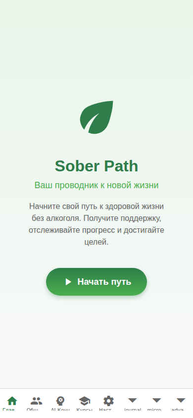
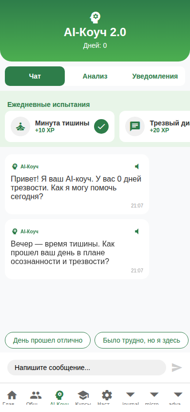
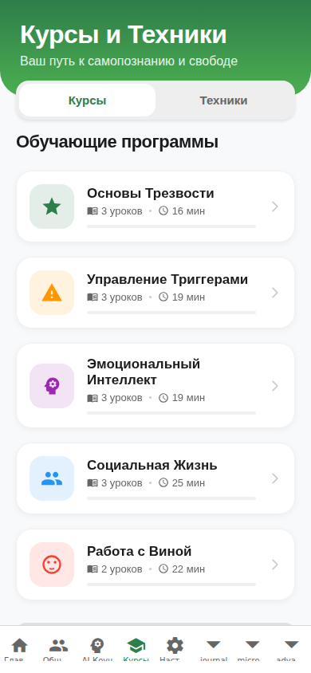
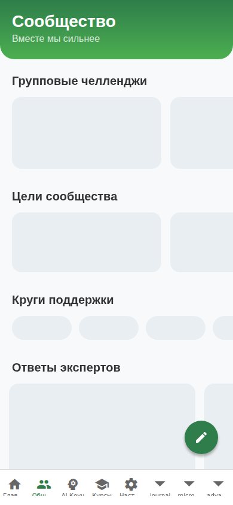
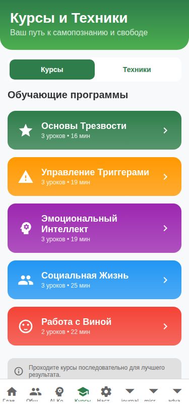
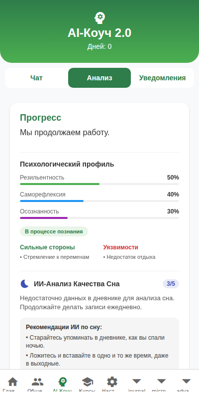
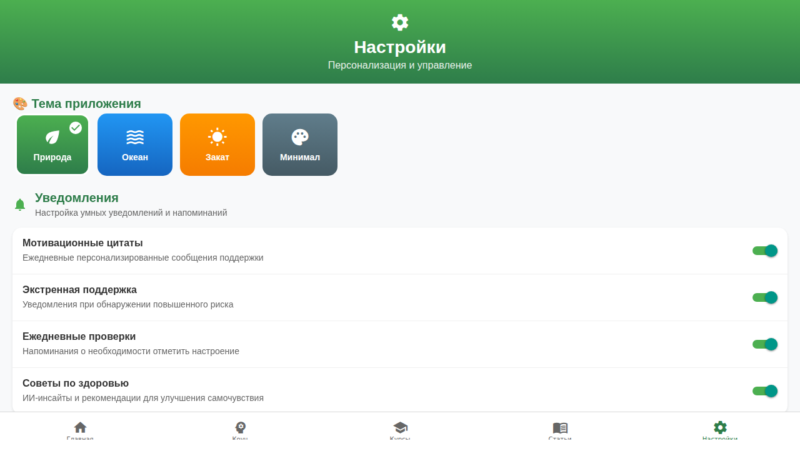

<div align="center">

# 🌿 Sober-Path

### Путь к осознанной трезвости

[](https://github.com/mx57/Sober-Path/releases)
[](https://opensource.org/licenses/MIT)
[](https://expo.dev/)
[](https://reactnative.dev/)
[](https://www.typescriptlang.org/)
[]()
[]()

</div>

---

## 📋 О проекте

**Sober-Path** — это комплексное мобильное приложение для поддержки трезвости и выздоровления от алкогольной зависимости. Приложение разработано на базе современных технологий React Native + Expo и объединяет evidence-based методы психотерапии (КПТ, DBT, ACT, EMDR, НЛП), искусственный интеллект и силу сообщества для создания персонализированной системы поддержки на каждом этапе пути к трезвости.

Ядро приложения — **AI-Коуч**, который отслеживает настроение и состояние пользователя, формирует персонализированные рекомендации и проактивно предлагает техники снятия стресса в моменты повышенной тяги. Система обладает памятью достижений и историей взаимодействий, что позволяет коучу адаптироваться к индивидуальным потребностям каждого пользователя и предлагать именно те инструменты, которые работают в конкретной ситуации.

Помимо AI-поддержки, Sober-Path предлагает обширную экосистему инструментов: интерактивные упражнения с гидируемым режимом, микро-курсы по психологии зависимости, мини-игры для когнитивного тренинга, дневник с AI-анализом, терапевтические звуки и бинауральные ритмы, gamification-систему с достижениями и квестами, а также живое сообщество с «Кругами поддержки». Всё это доступно на русском и английском языках и работает на Android, iOS и Web.

---

## 📸 Интерфейс приложения

<div align="center">

| Домашний экран | AI-Коуч | Курсы | Сообщество |
|:---:|:---:|:---:|:---:|
|  |  |  |  |

| Тренажёр | AI-Аналитика | Упражнения | Настройки |
|:---:|:---:|:---:|:---:|
|  |  |  |  |

</div>

> *Скриншоты демонстрируют актуальный интерфейс приложения версии 1.17.0.*

---

## ✨ Возможности приложения

### 🤖 AI-Коуч
- **Персонализированная поддержка** — анализ настроения и уровня тяги в реальном времени
- **Проактивная помощь** — автоматическое предложение техник снятия стресса при обнаружении тревожных паттернов
- **Память достижений** — коуч помнит ваши успехи и использует их для укрепления мотивации
- **Быстрые старты** — динамические кнопки начала диалога для мгновенного доступа к нужным инструментам
- **Персональные инсайты** — AI анализирует данные за период и выдаёт рекомендации

### 💬 AI-Чат
- **Разговорная поддержка** — свободный диалог с AI-ассистентом
- **Глубокие ссылки** — переход из чата на статьи и упражнения по теме
- **Контекстуальные ответы** — учёт истории предыдущих разговоров

### 👥 Сообщество и «Круги поддержки»
- **Тематические круги** — фильтрация ленты по категориям: *Мотивация, Вопросы, Поддержка, Достижения*
- **Обмен опытом** — истории успеха и инсайты от людей на аналогичном этапе пути
- **Система кармы** — оценка и модерация контента
- **Реакции и комментарии** — обратная связь от сообщества
- **Безопасная среда** — модерируемое пространство для открытого диалога

### 📚 База знаний (50+ статей)
- **Глубокая экспертиза** — материалы по нейробиологии зависимости, психологии границ, стоицизму и биохакингу
- **Система «Избранное»** — сохранение важных статей для быстрого доступа в моменты кризиса
- **Поиск и теги** — удобная навигация по обширной библиотеке знаний
- **Квизы по статьям** — проверка усвоения материала

### 📖 Тренировки (Микро-курсы)
- **Структурированное обучение** — пошаговые программы по психологии зависимости
- **Микро-курсы** — короткие модули, доступные в любое время
- **Прогресс-трекинг** — отслеживание завершения уроков и курсов
- **Практические задания** — закрепление теории через упражнения

### 🧘 Упражнения
- **NLP-техники** — лингвистические паттерны для работы с подсознанием
- **Когнитивно-поведенческая терапия (КПТ)** — выявление и трансформация дисфункциональных мыслей
- **Диалектическая поведенческая терапия (DBT)** — навыки эмоциональной регуляции
- **Терапия принятия и ответственности (ACT)** — принятие и осознанность
- **EMDR-техники** — переработка травматических воспоминаний
- **Майндфулнес** — медитативные практики осознанности
- **Микро-техники** — быстрые упражнения на 1–3 минуты для экстренной помощи
- **Интерактивный гидируемый режим** — пошаговое проведение с обратной связью

### 📈 Аналитика и прогресс
- **Трекер трезвости** — точный учёт дней, серий и личных рекордов
- **Тренды настроения** — визуальные графики эмоциональной динамики
- **Анализ триггеров** — выявление паттернов, влияющих на состояние
- **Продвинутая аналитика** — глубокая статистика с визуализациями

### 🏆 Gamification
- **Система достижений** — разблокировка наград за вехи в пути к трезвости
- **Квесты** — ежедневные и недельные задания для поддержания мотивации
- **Очки опыта (XP)** — прогрессия через уровни активности
- **Карта квестов** — визуальное представление пути развития

### 🎮 Мини-игры
- **Когнитивный тренинг** — упражнения на внимание, память и принятие решений
- **Игровая мотивация** — весёлый способ поддерживать активность

### 📝 Дневник
- **Ежедневные записи** — фиксация мыслей, настроения и событий
- **AI-анализ** — автоматическое выявление паттернов и инсайтов
- **Теги и категории** — удобная организация записей

### 🔊 Звуки
- **Терапевтические звуки** — бинауральные ритмы для релаксации и фокусировки
- **Звуки природы** — атмосферные звуки для медитации и засыпания
- **Продвинутый плеер** — настройка длительности, повтора и микширования

### 🚨 Экстренная помощь (SOS)
- **Быстрый доступ к помощи** — одна кнопка для получения поддержки в кризисный момент
- **Контакты кризисных служб** — информация о горячих линиях
- **Кризисное вмешательство** — пошаговые техники стабилизации состояния

### 🎯 Персонализированные рекомендации
- **Умный движок рекомендаций** — подбор контента на основе поведения и предпочтений
- **Адаптивная лента** — приложение учится и показывает наиболее релевантные инструменты

### 🧠 Продвинутая терапия
- **Травмо-ориентированный подход** — безопасная работа с травматическим опытом
- **Интегративная терапия** — сочетание методов разных направлений
- **Интерактивная медитация** — гидируемые сессии с обратной связью
- **Продвинутые NLP-тренировки** — глубокая работа с языковыми паттернами

### 🚀 Онбординг
- **Пошаговое знакомство** — интерактивный туториал для нового пользователя
- **Персонализация на старте** — настройка целей и предпочтений

### 🌐 Интернационализация
- **Русский / Английский** — полная локализация интерфейса через i18next

---

## 🛠 Технологический стек

| Категория | Технологии |
|---|---|
| **Язык** | TypeScript 5.x |
| **Фреймворк** | React Native 0.79 |
| **Платформа** | Expo SDK 53 (Expo Router, Expo CLI) |
| **Навигация** | Expo Router (файловая маршрутизация), React Navigation |
| **Состояние** | Zustand 5.x, React Context, Redux |
| **Анимации** | React Native Reanimated 3.x, Lottie |
| **UI-компоненты** | React Native Paper, NativeWind, Lucide Icons, Expo Vector Icons |
| **Графики** | React Native Chart Kit, React Native Skia |
| **Аудио** | Expo Audio, Expo Speech (TTS) |
| **Хранение** | AsyncStorage, Expo Secure Store, Expo SQLite |
| **Уведомления** | Expo Notifications, Expo Task Manager |
| **Локализация** | i18next, react-i18next |
| **Тестирование** | Jest, Jest-Expo, Testing Library |
| **Платформы** | Android, iOS, Web |

---

## 🏗 Архитектура

Приложение построено по паттерну **MVVM (View → ViewModel → Service)**, обеспечивающему разделение ответственности, тестируемость и масштибируемость кодовой базы.

```
┌─────────────┐     ┌──────────────┐     ┌─────────────┐
│     View     │────▶│  ViewModel   │────▶│   Service   │
│  (Screens/  │◀────│   (Hooks)    │◀────│ (Business   │
│  Components)│     │              │     │    Logic)   │
└─────────────┘     └──────────────┘     └─────────────┘
```

### Слой View
- **Экраны** (`app/(tabs)/`) — файловая маршрутизация Expo Router
- **Компоненты** (`components/`) — переиспользуемые UI-элементы

### Слой ViewModel
- **Хуки** (`hooks/`) — вью-модели, связывающие представление с логикой
- **Контексты** (`contexts/`) — глобальное состояние приложения

### Слой Service
- **Сервисы** (`services/`) — бизнес-логика, AI-модули, базы данных

---

## 🚀 Начало работы

### Предварительные требования
- [Node.js](https://nodejs.org/) 18+
- [Expo CLI](https://docs.expo.dev/get-started/installation/)
- Смартфон с [Expo Go](https://expo.dev/go) или эмулятор

### Установка

```bash
# 1. Клонируйте репозиторий
git clone https://github.com/mx57/Sober-Path.git
cd Sober-Path

# 2. Установите зависимости
npm install --legacy-peer-deps

# 3. Запустите проект
npx expo start
```

### Запуск на разных платформах

```bash
# Android (эмулятор/устройство)
npx expo run:android

# iOS (только macOS + Xcode)
npx expo run:ios

# Веб-браузер
npx expo start --web
```

### Тестирование

```bash
npm test
```

---

## 📁 Структура проекта

```
Sober-Path/
├── app/                          # Экраны приложения (Expo Router)
│   ├── (tabs)/                   # Основные вкладки
│   │   ├── index.tsx             # Главный экран
│   │   ├── ai-coach.tsx          # AI-Коуч
│   │   ├── ai-chat.tsx           # AI-Чат
│   │   ├── community.tsx         # Сообщество
│   │   ├── articles.tsx          # База знаний
│   │   ├── courses.tsx           # Тренировки
│   │   ├── micro-courses.tsx     # Микро-курсы
│   │   ├── exercises.tsx         # Упражнения
│   │   ├── enhanced-exercises.tsx # Расширенные упражнения
│   │   ├── analytics.tsx         # Аналитика
│   │   ├── advanced-analytics.tsx # Продвинутая аналитика
│   │   ├── journal.tsx           # Дневник
│   │   ├── sounds.tsx            # Звуки
│   │   ├── gamification.tsx      # Gamification
│   │   ├── mini-games.tsx        # Мини-игры
│   │   ├── therapy.tsx           # Терапия
│   │   ├── advanced-therapy.tsx  # Продвинутая терапия
│   │   ├── psychology.tsx        # Психология
│   │   ├── personalized-recommendations.tsx
│   │   ├── profile.tsx           # Профиль
│   │   └── enhanced-settings.tsx # Настройки
│   └── i18n/                     # Локализация
├── services/                     # Бизнес-логика
│   ├── AICoachService.ts         # AI-Коуч
│   ├── communityService.ts       # Сообщество
│   ├── articlesDatabase.ts       # База статей
│   ├── microCoursesService.ts    # Микро-курсы
│   ├── enhancedNLPService.ts     # NLP-техники
│   ├── therapeuticTechniques.ts  # Терапевтические техники
│   ├── traumaTherapyService.ts   # Травмо-ориентированная терапия
│   ├── integrativeTherapyService.ts
│   ├── interactiveMeditationService.ts
│   ├── miniGamesService.ts       # Мини-игры
│   ├── journalService.ts         # Дневник
│   ├── audioService.ts           # Аудио-плеер
│   ├── recoveryService.ts        # Трекер трезвости
│   ├── advancedInsightsService.ts
│   ├── advancedMoodTracker.ts
│   ├── smartRecommendationEngine.ts
│   ├── smartNotificationService.ts
│   ├── sosService.ts             # Экстренная помощь
│   ├── personalizationService.ts
│   ├── dailyMotivationService.ts
│   ├── psychologyKnowledgeBase.ts
│   ├── questService.ts           # Квесты
│   └── ...
├── components/                   # Переиспользуемые UI-компоненты
│   ├── AchievementSystem.tsx     # Система достижений
│   ├── AdvancedAudioPlayer.tsx   # Продвинутый аудио-плеер
│   ├── AdvancedTherapyPlayer.tsx
│   ├── ArticleQuiz.tsx           # Квизы
│   ├── CrisisIntervention.tsx    # Кризисное вмешательство
│   ├── ProgressAnalytics.tsx     # Визуализация прогресса
│   ├── QuestMap.tsx              # Карта квестов
│   ├── TherapeuticSoundPlayer.tsx
│   └── home/                     # Компоненты главного экрана
├── hooks/                        # Кастомные хуки (ViewModel)
│   ├── useAICoachViewModel.tsx
│   ├── useAnalytics.tsx
│   ├── useAnalyticsViewModel.tsx
│   ├── useRecovery.tsx
│   └── useThemeColor.ts
├── contexts/                     # React Context (глобальное состояние)
│   ├── RecoveryContext.tsx
│   └── AnalyticsContext.tsx
├── constants/                    # Константы приложения
├── assets/                       # Статические ресурсы
│   ├── images/                   # Изображения и иконки
│   ├── fonts/                    # Шрифты
│   └── screenshots/              # Скриншоты для README
├── __tests__/                    # Тесты
├── app.json                      # Конфигурация Expo
├── package.json                  # Зависимости
├── tsconfig.json                 # Конфигурация TypeScript
├── babel.config.js               # Конфигурация Babel
└── jest.config.js                # Конфигурация Jest
```

---

## 🤝 Участие в разработке

Мы приветствуем вклад каждого разработчика! Вот как можно помочь:

### Как начать
1. **Форкните** репозиторий
2. **Создайте** ветку для вашей фичи: `git checkout -b feature/amazing-feature`
3. **Сделайте** коммиты: `git commit -m 'feat: добавлен amazing feature'`
4. **Отправьте** в ветку: `git push origin feature/amazing-feature`
5. **Откройте** Pull Request

### Рекомендации
- Следуйте паттерну **MVVM** при добавлении нового функционала
- Сервисная логика — в `services/`, UI-модели — в `hooks/`, представление — в `components/`
- Пишите тесты для нового функционала (`__tests__/`)
- Используйте **TypeScript** строго, избегайте `any`
- Добавляйте локализацию для нового контента (`i18n/`)
- Соблюдайте стиль кода (ESLint конфигурация в проекте)

---

## 📜 Лицензия

Этот проект распространяется под лицензией **MIT License**.

```
MIT License

Copyright (c) 2024 Sober-Path Contributors

Permission is hereby granted, free of charge, to any person obtaining a copy
of this software and associated documentation files (the "Software"), to deal
in the Software without restriction, including without limitation the rights
to use, copy, modify, merge, publish, distribute, sublicense, and/or sell
copies of the Software, and to permit persons to whom the Software is
furnished to do so, subject to the following conditions:

The above copyright notice and this permission notice shall be included in all
copies or substantial portions of the Software.

THE SOFTWARE IS PROVIDED "AS IS", WITHOUT WARRANTY OF ANY KIND, EXPRESS OR
IMPLIED, INCLUDING BUT NOT LIMITED TO THE WARRANTIES OF MERCHANTABILITY,
FITNESS FOR A PARTICULAR PURPOSE AND NONINFRINGEMENT. IN NO EVENT SHALL THE
AUTHORS OR COPYRIGHT HOLDERS BE LIABLE FOR ANY CLAIM, DAMAGES OR OTHER
LIABILITY, WHETHER IN AN ACTION OF CONTRACT, TORT OR OTHERWISE, ARISING FROM,
OUT OF OR IN CONNECTION WITH THE SOFTWARE OR THE USE OR OTHER DEALINGS IN THE
SOFTWARE.
```

---

<div align="center">

### 🌿 Каждый трезвый день — это победа.

*Ты сильнее, чем думаешь. Путь к свободе начинается с одного шага.*

**Sober-Path** — делаем путь к трезвости осознанным и достижимым.

---

*Сделано с ❤️ для тех, кто выбирает жизнь без зависимости.*

</div>
