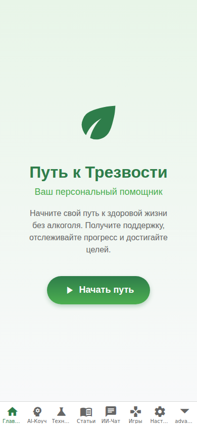
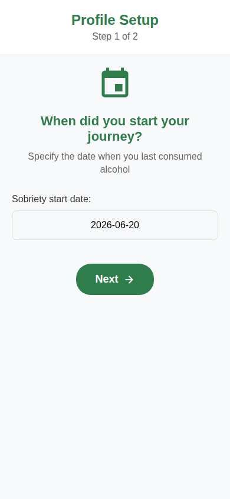

# Sober-Path 🌿

Персональный ассистент на пути к трезвости. Приложение помогает отслеживать прогресс, получать психологическую поддержку и справляться с тягой с помощью современных методов терапии.

## 📸 Интерфейс приложения

<div align="center">
  
  
</div>

## ✨ Основные функции

- **Трекер трезвости**: Отслеживание дней без алкоголя, серий и достижений.
- **AI-Коуч 2.0**: Персональный помощник, использующий современные психологические методики для поддержки.
- **Продвинутая терапия**: Доступ к библиотеке техник (КПТ, DBT, EMDR, IFS) и терапевтическим звукам.
- **Аналитика прогресса**: Детальная статистика настроения и выявление паттернов тяги.
- **Интернационализация**: Полная поддержка русского и английского языков.

## 🛠 Технологический стек

- **Frontend**: React Native (Expo SDK 53)
- **Язык**: TypeScript
- **Архитектура**: MVVM (View-ViewModel-Service)
- **Управление состоянием**: Zustand & Custom Hooks
- **Анимации**: React Native Reanimated
- **Интернационализация**: i18next
- **Тестирование**: Jest

## 🚀 Начало работы

1. Установите зависимости:
   ```bash
   npm install --legacy-peer-deps
   ```
2. Запустите проект:
   ```bash
   npx expo start
   ```

## 📈 Проведенные улучшения

В рамках ревью проекта были выполнены следующие работы:
- **Рефакторинг**: Переход на архитектуру MVVM для улучшения тестируемости и чистоты кода.
- **Консолидация**: Объединение разрозненных сервисов в единые модули `PsychologyService` и `AICoachService`.
- **Локализация**: Внедрена система i18n, переведены основные разделы приложения.
- **Оптимизация**: Удалены неиспользуемые зависимости, исправлены ошибки импорта.
- **Android Ready**: Обеспечена корректная работа аудио и UI на Android-устройствах.
- **Тестирование**: Добавлены юнит-тесты для критической бизнес-логики.

---
*Приложение разработано с заботой о вашем здоровье и благополучии.*
