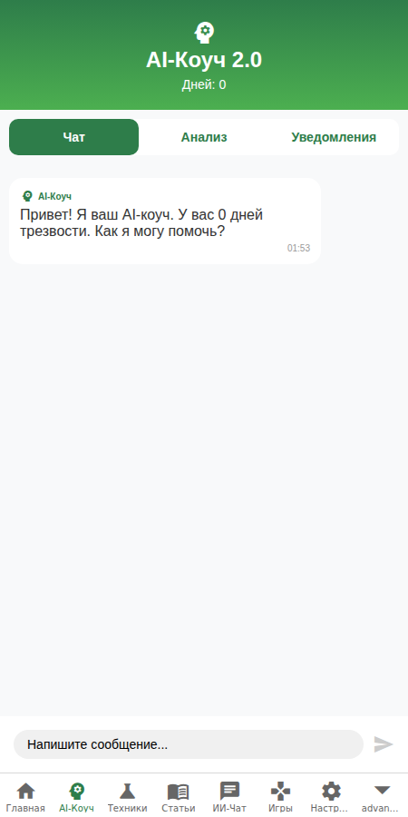
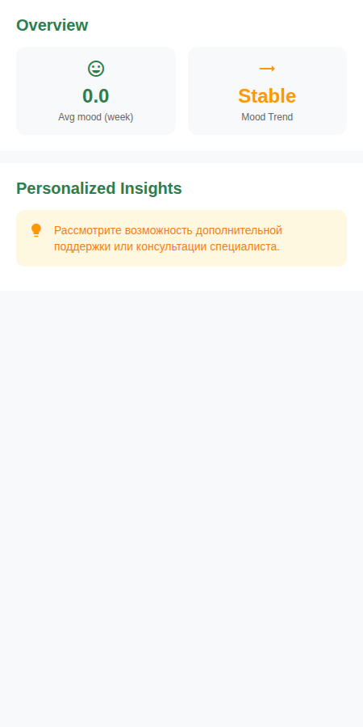
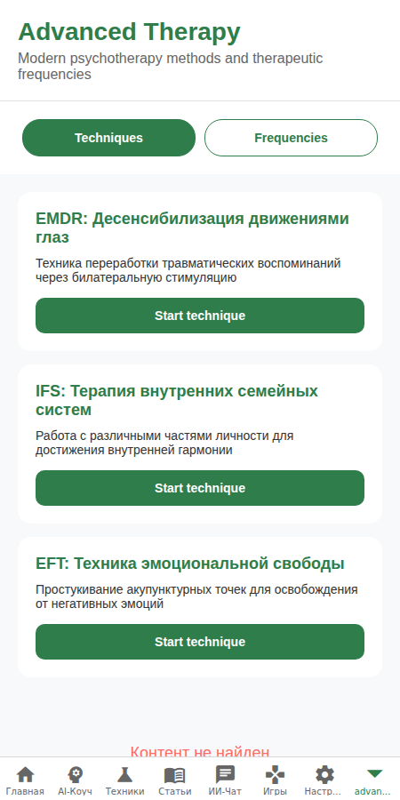

# Sober-Path 🌿 — Путь к осознанной трезвости

[](https://opensource.org/licenses/MIT)
[](https://expo.dev/)
[](https://reactnative.dev/)
[](https://www.typescriptlang.org/)
[]()

**Sober-Path** — это ваш персональный спутник и ассистент на пути к освобождению от алкогольной зависимости. Приложение объединяет современные методы психотерапии, искусственный интеллект и поддержку сообщества, чтобы сделать процесс выздоровления системным, осознанным и поддерживающим.

---

## 📸 Интерфейс приложения

<div align="center">
  
  
  
  
  
</div>

> *Примечание: Скриншоты демонстрируют актуальный интерфейс версии 1.6.0.*

---

## ✨ Ключевые возможности

### 🤖 Интеллектуальный AI-Коуч 2.0
*   **Персонализированная поддержка**: Ассистент анализирует ваше настроение и уровень тяги в реальном времени.
*   **Проактивная помощь**: Система автоматически предлагает техники снятия стресса, если обнаруживает тревожные паттерны.
*   **Быстрые старты**: Динамические кнопки начала диалога для мгновенного доступа к нужным инструментам.
*   **Память достижений**: Коуч помнит ваши успехи и использует их для укрепления мотивации.

### 💬 Сообщество и "Круги поддержки"
*   **Тематические Круги**: Фильтрация ленты по категориям: *Мотивация, Вопросы, Поддержка, Достижения*.
*   **Обмен опытом**: Читайте истории успеха и делитесь своими инсайтами с теми, кто находится на аналогичном этапе пути.
*   **Безопасная среда**: Модерируемое пространство для открытого диалога.

### 📚 База знаний (50+ статей)
*   **Глубокая экспертиза**: Материалы по нейробиологии зависимости, психологии границ, стоицизму и биохакингу.
*   **Система "Избранное"**: Сохраняйте наиболее важные статьи для быстрого доступа в моменты кризиса.
*   **Поиск и теги**: Удобная навигация по обширной библиотеке знаний.

### 📈 Аналитика и Прогресс
*   **Трекер трезвости**: Точный учет дней, серий и личных рекордов.
*   **Тренд настроения**: Визуальный график вашей эмоциональной динамики за неделю.
*   **Умный дневник**: Автоматический анализ триггеров и факторов, влияющих на ваше состояние.

### 🧘 Продвинутая Терапия
*   **Библиотека техник**: Доступ к упражнениям из КПТ, DBT, EMDR и НЛП.
*   **Терапевтические звуки**: Встроенный плеер с бинауральными ритмами и звуками природы для релаксации.

---

## 🛠 Технологический стек

*   **Frontend**: React Native (Expo SDK 53)
*   **Архитектура**: MVVM (View-ViewModel-Service) для чистоты и тестируемости.
*   **Состояние**: Zustand & React Hooks.
*   **Визуализация**: React Native Reanimated, Lottie, React Native Chart Kit.
*   **Интернационализация**: i18next (Русский / Английский).
*   **Тестирование**: Jest & Jest-Expo.

---

## 🚀 Начало работы

1.  **Клонируйте репозиторий**:
    ```bash
    git clone https://github.com/your-repo/sober-path.git
    ```
2.  **Установите зависимости**:
    ```bash
    npm install --legacy-peer-deps
    ```
3.  **Запустите проект**:
    ```bash
    npx expo start
    ```

---

## 📈 История улучшений (Последние циклы)

*   **v1.6.1 (Исправление типов и линтинга)**: Устранены все ошибки TypeScript (`tsc --noEmit`: 0 ошибок) и все ошибки ESLint (`npm run lint`: 0 ошибок, 102 предупреждения). Добавлены недостающие методы/типы в сервисы (`advancedMoodTracker`, `interactiveMeditation`, `personalization`, `notificationService`, `smartNotificationService`, `audioService`, `PsychologyService`), исправлены TS-ошибки в компонентах (`sounds`, `gamification`, `mini-games`, `ai-coach`, `enhanced-exercises`, `enhanced-settings`, `personalized-recommendations` и др.), заданы `displayName` для `React.memo`, добавлены Jest-глобали в `eslint.config.js`. Все тесты проходят: `npm test` — 5/5.
*   **v1.6.0 (Цикл 6)**: Внедрены "Круги" в Сообщество, добавлен виджет аналитики настроения, база знаний расширена до 50+ статей, улучшена память AI-коуча.
*   **v1.5.0 (Цикл 5)**: Добавлены "Ежедневные испытания", глубокие ссылки из чата на статьи, обновлен UI карточек сообщества.
*   **v1.4.0 (Цикл 4)**: Реализована озвучка (TTS) для коуча, "Умный дневник", Lottie-анимации достижений.

---
*Разработано с целью сделать путь к трезвости осознанным и достижимым. Берегите себя!* 🌿
